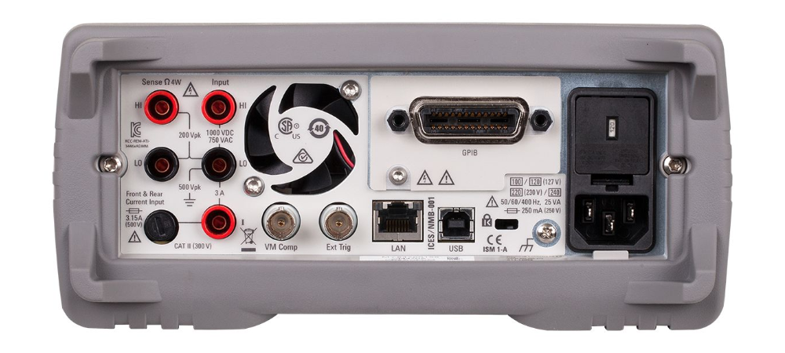
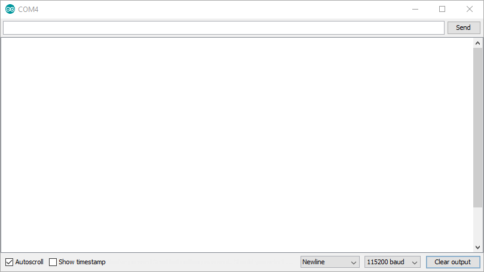
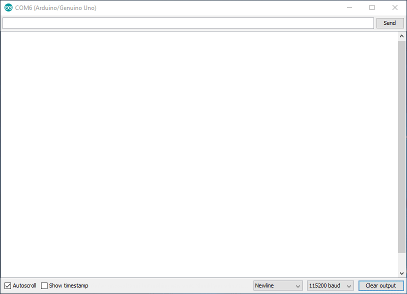

# USBTMC HOST Driver
USBTMC (USB Test and Measurement Class) is a set of standard device class specifications, built on top of the USB standard.

This driver allows you to communicate with Measurement Instruments.
To use it you will need USB Host Shield 2.0, USB Host Shield Library, and some measurement instruments which have a USB Female Type B connector.

You can create your user interface or recall your favorite settings when you press a button on your Arduino board.

Some measurement instruments disabled remote control by default, so you need to enable USBTMC(or remote control) followed the instruction manual.

You can find a demonstration on my [youtube channel](https://youtu.be/sLFJQBhXwgE).

# Where is the USBTMC?
You can find it on your instrument's back panel.
The USB Type B device port offers instrument control.

# Example sketch
Some example sketches are stored in the [Examples folder](Examples).

# Quick Start sketch(V2)
[USBTMCHostV2](USBTMCHostV2) supports binary transmit, reading status byte, and clearing pending transations.
The following demonstration queries instrument identification(*IDN?) in various way and shows some new features.

# Quick Start sketch(V1)
I wrote a sketch that converts USBTMC to Serial communication.

The sketch shows up some USBTMC information(Capabilities) on serial monitor when you plug USBTMC devices into the USB Host Shield.

You type "*IDN?", press send button, then the USBTMC device responds an identifying string.

If you get a timeout message, the device doesn't support a command you typed.

